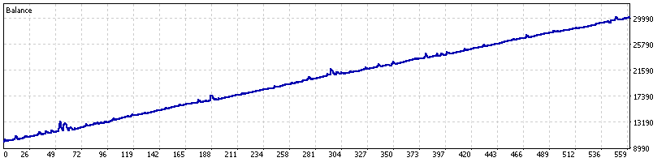
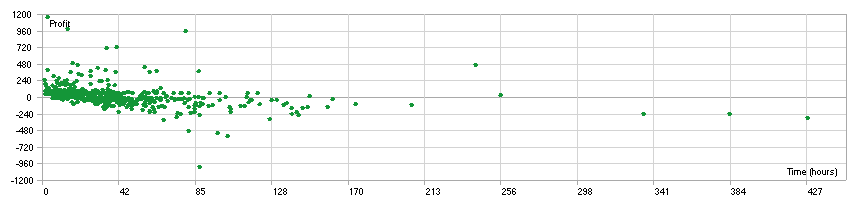

	
    

# Vortex Prime v6.0

Vortex Prime is a complex, high-end Forex trading robot for traders who want full functionality and complete customization. It combines **Grid and Martingale** strategies with **technical indicators** like MACD, RSI, Stochastic, and CCI in order to make well-grounded trading decisions. The bot has **no stop-loss** mechanism in its configuration; instead, the strategic logic controls trades, lots, and conditions for taking a profit. This will provide flexibility in tuning the bot's behavior for different market conditions and trading styles.

# Disclaimer
This Forex Expert Advisor (EA) is for educational purposes only. Never trade with money you cannot afford to lose. **USE THIS EA AT YOUR OWN RISK. THE AUTHORS AND ALL AFFILIATES ASSUME NO RESPONSIBILITY FOR YOUR TRADING RESULTS.**

Run the EA in Dry-run mode first, and only after you understand how it works and what kind of profit/loss it can bring, then engage real money.

We highly recommend that you have a good grasp of concepts related to trading and MetaTrader 5. Get familiar with the source code and the mechanism of this EA to ensure that it serves your needs and risk tolerance in trading.

# Data
Backtesting Details:

- Currency Pair: GBPUSD
- Interval: H1 (Hourly)
- Initial Deposit: \$10,000
- Time Period: August 9, 2022 - August 9, 2024 (2 years)

The dataset represents a 2-year price movement of the GBP/USD on an hourly time frame, backtesting trades made with the initial deposit of \$10,000. The dataset may be used to develop backtesting on the Vortex Prime Forex Trading Bot and its performance and effectiveness may be established over a longer period.

# Result

	
    
Backtesting result

| Metric                    | Value                 |
| ------------------------- | --------------------- |
| Total net Profit          | \$20,168.30           |
| Profit per month          | \$840.35              |
| Balance Drawdown Maximal  | \$1,545.10 (11.61\%)  |
| Equity Drawdown Maximal   | \$4,472.90 (15.16\%)  |
| Total trades              | 558                   |
| Profit Trades             | 364 (65.23\%)	        |
| Average profit trade      | \$99.83	            |
| Average loss trade        | $-83.34               |

It turned out that for the whole period, this was a total net profit of \$20,168.30. The average monthly profit equaled \$840.35. Balance maximum drawdowns were \$1,545.10 (11.61\%), while those in equity were \$4,472.90 (15.16\%). The EA executed 558 trades in total, whereby 364 of them were profitable, which is 65.23\% of the total. The average profit per trade was \$99.83, and the average loss per trade was \$-83.34.

	
    
Holding period

The above distribution indicates that most trades are of a short holding period, meaning the EA has been frequently opening and closing trades within a very short duration. This corresponds with the grid and martingale strategy, which mostly consists of multiple trades over shorter periods to capture market movements.

